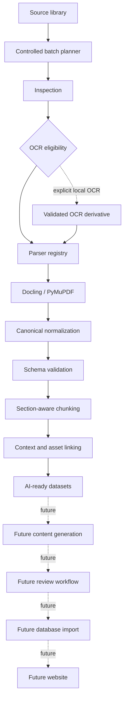

# Ingestion architecture

## System boundary

The canonical `NormalizedDocument` schema is the boundary between source ingestion and downstream
processing. Source parsers are isolated because PDF, PPTX, DOCX, Docling, and PyMuPDF details are
format-specific and may change. Chunking, dataset construction, and future generators accept only a
validated canonical `document.json`; they never reopen a raw source document or import source parser
classes.

This boundary makes navigation and provenance explicit. Page and slide numbers, nullable DOCX
pagination, block IDs, bounding boxes, tables, assets, source excerpts, hashes, and relative paths
have one validated representation. Missing data stays missing rather than being inferred later.

## Layer contracts

| Layer | Responsibility | Input | Output | Status |
|---|---|---|---|---|
| Source library | Read-only original documents | Local files | Immutable source paths | Complete |
| Batch planner/executor | Deterministic selection, validated resume, routing, and reports | Inspection plus existing artifacts | Atomic batch state and per-document results | Complete |
| Inspection | Recursive metadata and PDF inspection | Source paths | Manifests and classifications | Complete |
| OCR eligibility | Decide from physical text/image evidence | One inspected PDF | Required/recommended/not-needed/blocked | Complete |
| OCR derivative | Explicit OCRmyPDF/Tesseract execution and quality gate | One eligible original PDF | Validated derivative package | Current milestone |
| Parser registry | Select a format adapter | Supported source path | Parser result | Complete |
| Docling / PyMuPDF | Local-only structured parsing and PDF enrichment | PDF, PPTX, DOCX plus validated local PDF artifacts | Internal structured data | Complete; PDF reliability hardened in current milestone |
| Canonical normalization | Remove parser-specific classes | Internal parser data | `NormalizedDocument` | Complete |
| Schema validation | Enforce navigation and relationships | `document.json` | Valid canonical model | Complete |
| Section-aware chunking | Select deterministic structural boundaries | Valid canonical model | `ChunkCollection` | Complete |
| Context and asset linking | Preserve headings, neighbors, tables, figures, and citations | Canonical blocks and objects | Grounded chunks | Complete |
| AI-ready datasets | Package validated chunks and provenance | Canonical document and chunks | `AIReadyDataset` | Complete |
| Content generation | Create draft learning material with citations | Valid dataset | Draft content | Future |
| Review workflow | Human approval and correction | Draft content | Reviewed content | Future |
| Database import | Persist approved records and provenance | Reviewed content | Database rows | Future |
| Website | Deliver reviewed material | Future database/API | User experience | Future |

## Source grounding and future integration

Chunk text, context, captions, formulas, table cells, and citations come from canonical source data.
The current layer performs no medical interpretation. Exact duplicates retain every source location,
and uncertain figures or tables remain independently available and explicitly unassociated.

Future generators must cite preserved source references and emit draft status. No generated medical
claim may be accepted without traceable document, location, block, table, or asset provenance. Cloud
storage, database import, review services, and the website integrate after dataset construction;
none is implemented in this local ingestion pipeline.

## Local model boundary

Only the raw PDF parser may initialize Docling layout and table models. It requires a validated local
artifact root and never permits implicit remote acquisition. Model initialization is lazy, cached on
the parser instance, and independent of the Office converter. Environment diagnostics validate the
runtime without opening a source document. Canonical validation, chunking, and dataset construction
remain model-free and continue to accept only canonical JSON.

Inspection, normalization, OCR derivatives, chunking, and dataset construction remain isolated
services. Controlled resumable batching now orchestrates those services without weakening their
boundaries. Content generation, review, cloud/database integration, and the website remain future
work.

## OCR boundary

OCR is never part of ordinary parsing. An explicit command creates a content-addressed derivative
outside `pdfsrc`; its hashes, page mapping, language configuration, and quality are validated before
the parser registry may consume it. The canonical OCR variant keeps the original SHA-256 as its
logical document ID and records derivative provenance separately. Chunks cite the original source
path and physical pages. Rejected derivatives cannot cross the chunking boundary.

## Batch boundary

The batch layer owns discovery, deterministic planning, routing, resume state, retries, and aggregate
reports. It does not interpret raw formats itself. Existing artifacts are trusted only after current
schema and provenance validation; directory existence is never completion. Execution is sequential
(`jobs=1`) until Docling and OCR can be safely isolated in worker processes.
