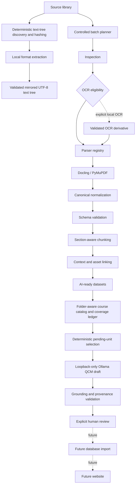

# Ingestion architecture

## System boundary

The canonical `NormalizedDocument` schema is the boundary between source ingestion and downstream
processing. Source parsers are isolated because PDF, PPTX, DOCX, Docling, and PyMuPDF details are
format-specific and may change. Chunking, dataset construction, and future generators accept only a
validated canonical `document.json`; they never reopen a raw source document or import source parser
classes.

This boundary makes navigation and provenance explicit. Page and slide numbers, nullable DOCX
pagination, block IDs, bounding boxes, tables, assets, source excerpts, hashes, and relative paths
have one validated representation. Missing data stays missing rather than being inferred later.

## Layer contracts

| Layer | Responsibility | Input | Output | Status |
|---|---|---|---|---|
| Source library | Read-only original documents | Local files | Immutable source paths | Complete |
| Mirrored text export | Deterministic discovery, hashing, local extraction, validation, and resume | Explicit local source tree | UTF-8 `.txt`, manifest, and concise reports | Complete |
| Batch planner/executor | Deterministic selection, validated resume, routing, and reports | Inspection plus existing artifacts | Atomic batch state and per-document results | Complete |
| Inspection | Recursive metadata and PDF inspection | Source paths | Manifests and classifications | Complete |
| OCR eligibility | Decide from physical text/image evidence | One inspected PDF | Required/recommended/not-needed/blocked | Complete |
| OCR derivative | Explicit OCRmyPDF/Tesseract execution and quality gate | One eligible original PDF | Validated derivative package | Current milestone |
| Parser registry | Select a format adapter | Supported source path | Parser result | Complete |
| Docling / PyMuPDF | Local-only structured parsing and PDF enrichment | PDF, PPTX, DOCX plus validated local PDF artifacts | Internal structured data | Complete; PDF reliability hardened in current milestone |
| Canonical normalization | Remove parser-specific classes | Internal parser data | `NormalizedDocument` | Complete |
| Schema validation | Enforce navigation and relationships | `document.json` | Valid canonical model | Complete |
| Section-aware chunking | Select deterministic structural boundaries | Valid canonical model | `ChunkCollection` | Complete |
| Context and asset linking | Preserve headings, neighbors, tables, figures, and citations | Canonical blocks and objects | Grounded chunks | Complete |
| AI-ready datasets | Package validated chunks and provenance | Canonical document and chunks | `AIReadyDataset` | Complete |
| Course catalog | Preserve folder taxonomy and inventory chunk-level knowledge units | One or more valid datasets | Immutable course catalog, units, and QCM coverage ledger | Complete for catalog and planning |
| QCM generation | Deterministic source selection and local structured drafting | Valid dataset | Draft/unreviewed QCMs | Complete |
| Grounding validation | Verify selected chunks, exact quotations, copied references, identity, and duplicates | Draft QCMs plus valid dataset | Technical validation reports | Complete |
| Review workflow | Record explicit terminal human decisions and export accepted questions | Valid draft content | Reviewed QCM content | Complete for local file workflow |
| Database import | Persist approved records and provenance | Reviewed content | Database rows | Future |
| Website | Deliver reviewed material | Future database/API | User experience | Future |

## Source grounding and future integration

Chunk text, context, captions, formulas, table cells, and citations come from canonical source data.
The current layer performs no medical interpretation. Exact duplicates retain every source location,
and uncertain figures or tables remain independently available and explicitly unassociated.

The QCM generator cites preserved source references and emits draft/unreviewed status. References
are copied from validated dataset chunks rather than trusted from model output. Evidence quotations
must occur in retained source text. Grounding and lexical checks are technical and never establish
medical correctness. Cloud storage, database import, hosted review services, and the website remain
future work.

## Course coverage boundary

Course schema `1.0.0` is independent from all ingestion and generation schemas. Course construction
uses validated datasets and finalized generation artifacts only; it never opens `pdfsrc`. Exact
source-folder segments and chunk section paths form a deterministic taxonomy, but these labels are
navigation metadata rather than evidence.

Each course knowledge unit points to one immutable dataset chunk. The QCM coverage ledger
distinguishes pending, excluded, failed, insufficient, revision-required, and human-accepted units.
Unreviewed drafts never count as completed coverage. Read-only course planning selects pending units
in stable document/chunk order under explicit budgets and makes no Ollama request. Course-plan
execution and non-QCM renderers remain future milestones.

## Mirrored text-export boundary

The text-tree workflow is a local export route beside canonical ingestion, not a new downstream
canonical format. It may reopen explicitly selected raw PDF, PPTX, DOCX, and TXT sources because
its sole purpose is faithful plain-text extraction. It does not feed chunking, datasets, QCM
generation, or course planning unless a later milestone explicitly defines such a boundary.

Discovery retains each source-relative path without Unicode normalization, hashes every regular
source file, plans collision-safe mirrored destinations, and executes sequentially. PDF extraction
uses the existing explicitly configured local Docling/PyMuPDF boundary. Office parsing remains
independent of PDF model initialization. OCR is never started; only an existing derivative with an
exact relative path, exact source SHA-256, valid derivative package, and accepted quality state may
be read.

Only successful `exported` and `exported_with_warnings` states materialize `.txt` files. Empty,
failed, unsupported, and OCR-required sources exist only in the manifest and run reports. Resume
requires matching source provenance, schema and metadata headers, navigation separators, and
output hash. A complete pre/post source snapshot verifies source-tree immutability. Dry-run hashes
and plans the tree and performs only minimum PyMuPDF inspection for OCR classification; it creates
nothing and never initializes Docling.

## Local model boundary

Only the raw PDF parser may initialize Docling layout and table models. It requires a validated local
artifact root and never permits implicit remote acquisition. Model initialization is lazy, cached on
the parser instance, and independent of the Office converter. Environment diagnostics validate the
runtime without opening a source document. Canonical validation, chunking, and dataset construction
remain model-free and continue to accept only canonical JSON.

Inspection, normalization, OCR derivatives, chunking, and dataset construction remain isolated
services. Controlled resumable batching orchestrates those services without weakening their
boundaries. Local QCM generation consumes only validated datasets and cannot reopen raw sources.
Cloud/database integration and the website remain future work.

## Course-text preparation boundary

Validated mirrored UTF-8 exports may enter the preparation route without reopening source PDFs,
PPTX files, DOCX files, canonical documents, chunks, or datasets. Mechanical cleaning and model
reconstruction are separate stages. The cleaner removes export-only metadata from the readable body,
normalizes only conservative presentation defects, classifies repeated front matter, and records a
raw-to-clean span map in a sidecar. Readiness is assessed per physical page, slide, or logical
document location; useful locations remain eligible even when other locations are image-dependent or
unusable.

Gemma 3 may reorganize bounded natural sections using only supplied source-span IDs. Deterministic
validation rejects new numbers, units, protected negations or modal words, lexical additions, omitted
source vocabulary, and unknown transformation spans. Rejected output falls back to clean source text.
MedGemma is a reviewer only: it records source-support classifications and never rewrites a course.
Disagreement also falls back to the source-derived clean version and requires human review. Generator
and reviewer models are unloaded between phases so they are not retained simultaneously.

Preparation outputs are atomic, mirrored, hash-validated, resumable per document and model section,
and stored under `data/yahyaouisalsa-clean` and `data/yahyaouisalsa-reconstructed`. This boundary does
not create QCMs, quizzes, flashcards, summaries, cases, questions, answers, or student objectives.

## Generation boundary

Generation schema `1.0.0` is independent of canonical, chunk, and dataset schema versions. Planning
validates one explicit dataset and deterministically chooses unique eligible chunks within character
and token budgets. Planning makes no provider request and writes nothing. The provider abstraction
supports a deterministic mock and a loopback-only Ollama HTTP implementation. Only the QCM route is
enabled; reserved content schemas do not imply generators.

Successful generation writes one protected directory atomically. Malformed provider data or failed
grounding produces no successful output. Instead, a separate append-only diagnostic attempt is
atomically finalized under `data/generated-failures`, without `generated-content.json`. Existing
generation directories are immutable, reviewed questions cannot be regenerated over, and
question-bank export includes only accepted content.

## OCR boundary

OCR is never part of ordinary parsing. An explicit command creates a content-addressed derivative
outside `pdfsrc`; its hashes, page mapping, language configuration, and quality are validated before
the parser registry may consume it. The canonical OCR variant keeps the original SHA-256 as its
logical document ID and records derivative provenance separately. Chunks cite the original source
path and physical pages. Rejected derivatives cannot cross the chunking boundary.

## Batch boundary

The batch layer owns discovery, deterministic planning, routing, resume state, retries, and aggregate
reports. It does not interpret raw formats itself. Existing artifacts are trusted only after current
schema and provenance validation; directory existence is never completion. Execution is sequential
(`jobs=1`) until Docling and OCR can be safely isolated in worker processes.
